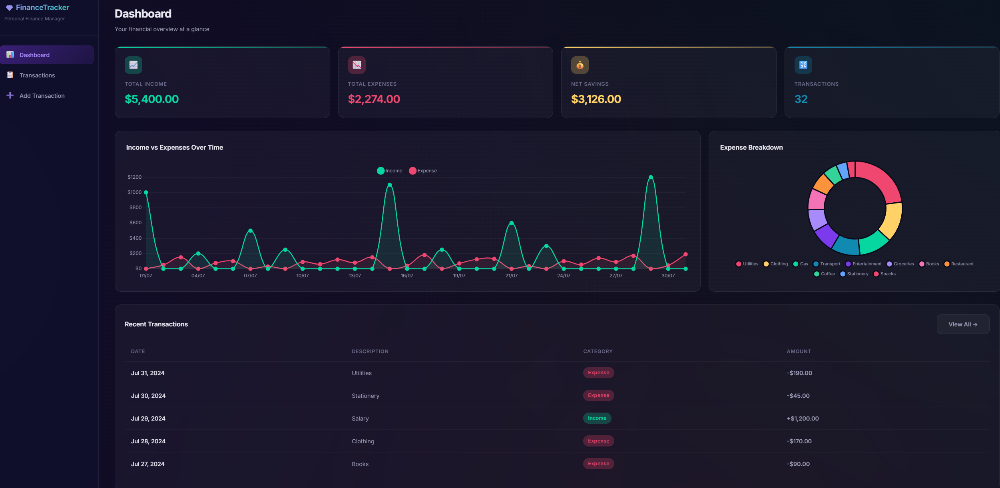

# 💎 Personal Finance Tracker

A modern, responsive, full-stack web application built to help you track your income, expenses, and savings at a glance.



## ✨ Features

- **Dynamic Dashboard**: Visualize your financial health with interactive `Chart.js` line and doughnut charts.
- **Premium UI**: Built with a sleek, dark-mode glassmorphism design system.
- **Mobile Responsive**: Fully optimized for mobile browsers with horizontal table scrolling and stacked form controls.
- **Smart Data Tables**: Client-side three-state sorting (Ascending, Descending, Unsorted) with instant filtering and search.
- **Dual-Mode Database**:
  - Automatically uses a local **SQLite** database (`finance_tracker.db`) when developing locally.
  - Seamlessly switches to a cloud **PostgreSQL** database when the `DATABASE_URL` environment variable is provided.
- **RESTful API**: Fast and robust backend powered by `FastAPI` and `SQLAlchemy`.

## 🚀 Tech Stack

- **Backend**: Python 3.11, FastAPI, SQLAlchemy
- **Database**: PostgreSQL (Cloud) / SQLite (Local)
- **Frontend**: Vanilla HTML5, CSS3, JavaScript (No heavy frameworks!)
- **Charts**: Chart.js
- **Deployment**: Docker, Render, Supabase

## 💻 Running Locally

To run this project on your local machine:

1. **Clone the repository**
   ```bash
   git clone https://github.com/romasahoo/Personal-Finance-Tracker.git
   cd Personal-Finance-Tracker
   ```

2. **Install dependencies**
   Make sure you have Python 3.11+ installed.
   ```bash
   pip install -r requirements.txt
   ```

3. **Start the server**
   ```bash
   python -m uvicorn app:app --reload
   ```

4. **View the app**
   Open your browser and navigate to: `http://localhost:8000`

*Note: The app will automatically create a local SQLite database and seed it with sample data if it's your first time running it.*

## ☁️ Cloud Deployment

This app is fully containerized and ready to be deployed for free using **Render** and **Supabase**.

1. **Database Setup (Supabase)**
   - Create a free project on [Supabase](https://supabase.com).
   - Go to Project Settings -> Database and copy the **Transaction Pooler** connection string (Port `6543`).

2. **App Deployment (Render)**
   - Create a new **Blueprint** on [Render](https://render.com) and connect this repository.
   - Render will automatically read the `render.yaml` and `Dockerfile`.
   - Provide the `DATABASE_URL` environment variable using your Supabase connection string.
   - Click Deploy!

## 📝 License

This project is open-source and available under the MIT License.
